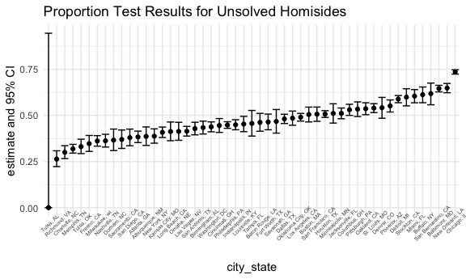
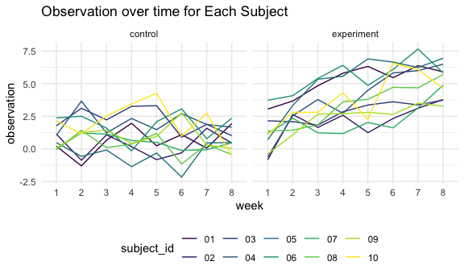
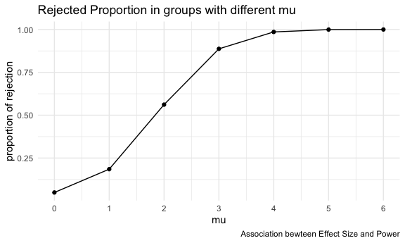
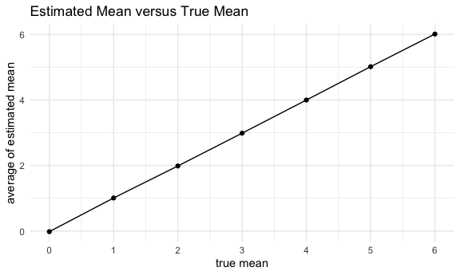
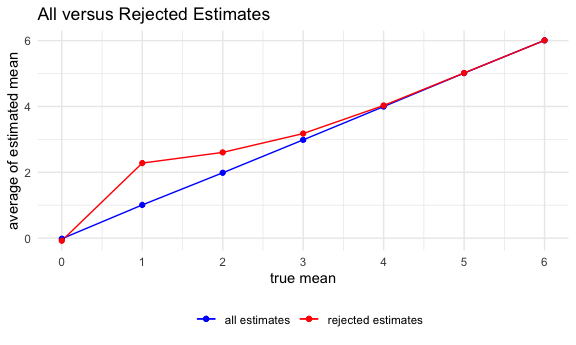

p8105_hw5_ml5018
================
Luan Mengxiao
2023-11-02

``` r
library(tidyverse)

options(tibble.print_min = 5)

knitr::opts_chunk$set(
  fig.width = 6,
  fig.asp = .6,
  out.width = "90%"
)

theme_set(theme_minimal() + theme(legend.position = "bottom"))

options(
  ggplot2.continuous.colour = "viridis",
  ggplot2.continuous.fill = "viridis"
)

scale_colour_discrete = scale_colour_viridis_d
scale_fill_discrete = scale_fill_viridis_d
```

# Problem 1

## summary of data

Describe the raw data.

``` r
homicides_data = 
  read_csv("data/homicide-data.csv") |>
  janitor::clean_names()
```

    ## Rows: 52179 Columns: 12
    ## ── Column specification ────────────────────────────────────────────────────────
    ## Delimiter: ","
    ## chr (9): uid, victim_last, victim_first, victim_race, victim_age, victim_sex...
    ## dbl (3): reported_date, lat, lon
    ## 
    ## ℹ Use `spec()` to retrieve the full column specification for this data.
    ## ℹ Specify the column types or set `show_col_types = FALSE` to quiet this message.

This data set contains data on homicides in 50 large U.S. cities,
gathered by the Washington Post. The Post has mapped more than 52,000
homicides in major American cities over the past decade and found that
across the country, there are areas where murder is common but arrests
are rare.

The data set consists of 52179 observations of 12 variables. A more
detailed summary of the raw data is posted below.

``` r
skimr::skim(homicides_data)
```

    ## Warning: There was 1 warning in `dplyr::summarize()`.
    ## ℹ In argument: `dplyr::across(tidyselect::any_of(variable_names),
    ##   mangled_skimmers$funs)`.
    ## ℹ In group 0: .
    ## Caused by warning:
    ## ! There were 16 warnings in `dplyr::summarize()`.
    ## The first warning was:
    ## ℹ In argument: `dplyr::across(tidyselect::any_of(variable_names),
    ##   mangled_skimmers$funs)`.
    ## Caused by warning in `grepl()`:
    ## ! unable to translate 'O<90>CRONIN' to a wide string
    ## ℹ Run `dplyr::last_dplyr_warnings()` to see the 15 remaining warnings.

|                                                  |                |
|:-------------------------------------------------|:---------------|
| Name                                             | homicides_data |
| Number of rows                                   | 52179          |
| Number of columns                                | 12             |
| \_\_\_\_\_\_\_\_\_\_\_\_\_\_\_\_\_\_\_\_\_\_\_   |                |
| Column type frequency:                           |                |
| character                                        | 9              |
| numeric                                          | 3              |
| \_\_\_\_\_\_\_\_\_\_\_\_\_\_\_\_\_\_\_\_\_\_\_\_ |                |
| Group variables                                  | None           |

Data summary

**Variable type: character**

| skim_variable | n_missing | complete_rate | min | max | empty | n_unique | whitespace |
|:--------------|----------:|--------------:|----:|----:|------:|---------:|-----------:|
| uid           |         0 |             1 |   9 |  10 |     0 |    52179 |          0 |
| victim_last   |         0 |             1 |   1 |  20 |     0 |    12687 |          0 |
| victim_first  |         0 |             1 |   1 |  28 |     0 |    16640 |          0 |
| victim_race   |         0 |             1 |   5 |   8 |     0 |        6 |          0 |
| victim_age    |         0 |             1 |   1 |   7 |     0 |      102 |          0 |
| victim_sex    |         0 |             1 |   4 |   7 |     0 |        3 |          0 |
| city          |         0 |             1 |   5 |  14 |     0 |       50 |          0 |
| state         |         0 |             1 |   2 |   2 |     0 |       28 |          0 |
| disposition   |         0 |             1 |  14 |  21 |     0 |        3 |          0 |

**Variable type: numeric**

| skim_variable | n_missing | complete_rate |        mean |         sd |          p0 |         p25 |         p50 |         p75 |          p100 | hist  |
|:--------------|----------:|--------------:|------------:|-----------:|------------:|------------:|------------:|------------:|--------------:|:------|
| reported_date |         0 |             1 | 20130899.16 | 1123419.63 | 20070101.00 | 20100318.00 | 20121216.00 | 20150911.00 | 201511105\.00 | ▇▁▁▁▁ |
| lat           |        60 |             1 |       37.03 |       4.35 |       25.73 |       33.77 |       38.52 |       40.03 |         45.05 | ▁▅▅▇▅ |
| lon           |        60 |             1 |      -91.47 |      13.75 |     -122.51 |      -96.00 |      -87.71 |      -81.76 |        -71.01 | ▃▁▃▇▅ |

## data manipulation

Create a `city_state` variable (e.g. “Baltimore, MD”) and then summarize
within cities to obtain the total number of homicides and the number of
unsolved homicides (those for which the disposition is “Closed without
arrest” or “Open/No arrest”).

``` r
homicides_data = 
  homicides_data |>
  mutate(city_state = str_c(city, ", ", state))

homicides_number = 
  homicides_data |>
  group_by(city_state) |>
  summarize(
    total_homicides = n(),
    unsolved_homicides = 
      sum(disposition %in% c("Closed without arrest","Open/No arrest")))
homicides_number
```

    ## # A tibble: 51 × 3
    ##   city_state      total_homicides unsolved_homicides
    ##   <chr>                     <int>              <int>
    ## 1 Albuquerque, NM             378                146
    ## 2 Atlanta, GA                 973                373
    ## 3 Baltimore, MD              2827               1825
    ## 4 Baton Rouge, LA             424                196
    ## 5 Birmingham, AL              800                347
    ## # ℹ 46 more rows

## proportion test

For the city of Baltimore, MD, use the `prop.test` function to estimate
the proportion of homicides that are unsolved; save the output of
`prop.test` as an R object, apply the `broom::tidy` to this object and
pull the estimated proportion and confidence intervals from the
resulting tidy dataframe.

``` r
Baltimore_number = 
  homicides_number |>
  filter(city_state == "Baltimore, MD")

Baltimore_result = 
  prop.test(x = pull(Baltimore_number, var = 3), 
          n = pull(Baltimore_number, var = 2)) |>
  broom::tidy()
Baltimore_result
```

    ## # A tibble: 1 × 8
    ##   estimate statistic  p.value parameter conf.low conf.high method    alternative
    ##      <dbl>     <dbl>    <dbl>     <int>    <dbl>     <dbl> <chr>     <chr>      
    ## 1    0.646      239. 6.46e-54         1    0.628     0.663 1-sample… two.sided

``` r
list(
  estimate = pull(Baltimore_result, estimate),
  CI_lower = pull(Baltimore_result, conf.low),
  CI_upper = pull(Baltimore_result, conf.high)
  ) |>
  bind_rows() |>
  knitr::kable()
```

|  estimate |  CI_lower |  CI_upper |
|----------:|----------:|----------:|
| 0.6455607 | 0.6275625 | 0.6631599 |

``` r
save(Baltimore_result, file = "result/baltimore_result.RData")
```

Now run `prop.test` for each of the cities in your dataset, and extract
both the proportion of unsolved homicides and the confidence interval
for each. Do this within a “tidy” pipeline, making use of `purrr::map`,
`purrr::map2`, list columns and unnest as necessary to create a tidy
dataframe with estimated proportions and CIs for each city.

``` r
unsolved_prop = function(city_state_name) {
  city_number = 
    homicides_number |>
    filter(city_state == city_state_name)
  
  city_result = 
    prop.test(x = pull(city_number, var = 3), n = pull(city_number, var = 2)) |>
    broom::tidy() |>
    select(estimate, conf.low, conf.high)
  
  city_result
}

city_name = unique(pull(homicides_data, city_state))
result = 
  expand_grid(city_name) |>
  mutate(test_result = map(city_name, unsolved_prop)) |>
  unnest(test_result)
```

    ## Warning: There was 1 warning in `mutate()`.
    ## ℹ In argument: `test_result = map(city_name, unsolved_prop)`.
    ## Caused by warning in `prop.test()`:
    ## ! Chi-squared approximation may be incorrect

``` r
result
```

    ## # A tibble: 51 × 4
    ##   city_name       estimate conf.low conf.high
    ##   <chr>              <dbl>    <dbl>     <dbl>
    ## 1 Albuquerque, NM    0.386    0.337     0.438
    ## 2 Atlanta, GA        0.383    0.353     0.415
    ## 3 Baltimore, MD      0.646    0.628     0.663
    ## 4 Baton Rouge, LA    0.462    0.414     0.511
    ## 5 Birmingham, AL     0.434    0.399     0.469
    ## # ℹ 46 more rows

Create a plot that shows the estimates and CIs for each city – check out
`geom_errorbar` for a way to add error bars based on the upper and lower
limits. Organize cities according to the proportion of unsolved
homicides.

``` r
result |>
  mutate(city_name = reorder(city_name, estimate)) |>
  ggplot(aes(x = city_name, y = estimate)) +
  geom_point(aes(y = estimate)) +
  geom_errorbar(aes(ymin = conf.low, ymax = conf.high)) +
  theme(axis.text.x = element_text(angle = 45, size = 5)) +
  labs(x = "city_state", 
       y = "estimate and 95% CI", 
       title = "Proportion Test Results for Unsolved Homisides")
```



# Problem 2

Create a tidy dataframe containing data from all participants, including
the subject ID, arm, and observations over time:

- Start with a dataframe containing all file names; the `list.files`
  function will help
- Iterate over file names and read in data for each subject using
  `purrr::map` and saving the result as a new variable in the dataframe
- Tidy the result; manipulate file names to include control arm and
  subject ID, make sure weekly observations are “tidy”, and do any other
  tidying that’s necessary
- Make a spaghetti plot showing observations on each subject over time,
  and comment on differences between groups.

``` r
file_name = 
  list.files(path = "./data/longitudinal_data/", pattern = ".csv")

longitudinal_data = 
  data_frame(file = file_name) |>
  mutate(
    file_path = str_c("data/longitudinal_data/", file),
    data = map(file_path, read_csv)) |>
  unnest(data) |>
  janitor::clean_names() |>
  separate(file, into = c("arm", "subject_id"), sep = "_") |>
  mutate(
    arm = as.factor(case_match(arm, "con" ~ "control", "exp" ~ "experiment")),
    subject_id = str_replace(subject_id, ".csv", "")
  ) |>
  pivot_longer(week_1:week_8, 
               names_to = "week",
               names_prefix = "week_",
               values_to = "observation") |>
  select(arm, subject_id, week, observation)
```

    ## Warning: `data_frame()` was deprecated in tibble 1.1.0.
    ## ℹ Please use `tibble()` instead.
    ## This warning is displayed once every 8 hours.
    ## Call `lifecycle::last_lifecycle_warnings()` to see where this warning was
    ## generated.

    ## Rows: 1 Columns: 8
    ## ── Column specification ────────────────────────────────────────────────────────
    ## Delimiter: ","
    ## dbl (8): week_1, week_2, week_3, week_4, week_5, week_6, week_7, week_8
    ## 
    ## ℹ Use `spec()` to retrieve the full column specification for this data.
    ## ℹ Specify the column types or set `show_col_types = FALSE` to quiet this message.
    ## Rows: 1 Columns: 8
    ## ── Column specification ────────────────────────────────────────────────────────
    ## Delimiter: ","
    ## dbl (8): week_1, week_2, week_3, week_4, week_5, week_6, week_7, week_8
    ## 
    ## ℹ Use `spec()` to retrieve the full column specification for this data.
    ## ℹ Specify the column types or set `show_col_types = FALSE` to quiet this message.
    ## Rows: 1 Columns: 8
    ## ── Column specification ────────────────────────────────────────────────────────
    ## Delimiter: ","
    ## dbl (8): week_1, week_2, week_3, week_4, week_5, week_6, week_7, week_8
    ## 
    ## ℹ Use `spec()` to retrieve the full column specification for this data.
    ## ℹ Specify the column types or set `show_col_types = FALSE` to quiet this message.
    ## Rows: 1 Columns: 8
    ## ── Column specification ────────────────────────────────────────────────────────
    ## Delimiter: ","
    ## dbl (8): week_1, week_2, week_3, week_4, week_5, week_6, week_7, week_8
    ## 
    ## ℹ Use `spec()` to retrieve the full column specification for this data.
    ## ℹ Specify the column types or set `show_col_types = FALSE` to quiet this message.
    ## Rows: 1 Columns: 8
    ## ── Column specification ────────────────────────────────────────────────────────
    ## Delimiter: ","
    ## dbl (8): week_1, week_2, week_3, week_4, week_5, week_6, week_7, week_8
    ## 
    ## ℹ Use `spec()` to retrieve the full column specification for this data.
    ## ℹ Specify the column types or set `show_col_types = FALSE` to quiet this message.
    ## Rows: 1 Columns: 8
    ## ── Column specification ────────────────────────────────────────────────────────
    ## Delimiter: ","
    ## dbl (8): week_1, week_2, week_3, week_4, week_5, week_6, week_7, week_8
    ## 
    ## ℹ Use `spec()` to retrieve the full column specification for this data.
    ## ℹ Specify the column types or set `show_col_types = FALSE` to quiet this message.
    ## Rows: 1 Columns: 8
    ## ── Column specification ────────────────────────────────────────────────────────
    ## Delimiter: ","
    ## dbl (8): week_1, week_2, week_3, week_4, week_5, week_6, week_7, week_8
    ## 
    ## ℹ Use `spec()` to retrieve the full column specification for this data.
    ## ℹ Specify the column types or set `show_col_types = FALSE` to quiet this message.
    ## Rows: 1 Columns: 8
    ## ── Column specification ────────────────────────────────────────────────────────
    ## Delimiter: ","
    ## dbl (8): week_1, week_2, week_3, week_4, week_5, week_6, week_7, week_8
    ## 
    ## ℹ Use `spec()` to retrieve the full column specification for this data.
    ## ℹ Specify the column types or set `show_col_types = FALSE` to quiet this message.
    ## Rows: 1 Columns: 8
    ## ── Column specification ────────────────────────────────────────────────────────
    ## Delimiter: ","
    ## dbl (8): week_1, week_2, week_3, week_4, week_5, week_6, week_7, week_8
    ## 
    ## ℹ Use `spec()` to retrieve the full column specification for this data.
    ## ℹ Specify the column types or set `show_col_types = FALSE` to quiet this message.
    ## Rows: 1 Columns: 8
    ## ── Column specification ────────────────────────────────────────────────────────
    ## Delimiter: ","
    ## dbl (8): week_1, week_2, week_3, week_4, week_5, week_6, week_7, week_8
    ## 
    ## ℹ Use `spec()` to retrieve the full column specification for this data.
    ## ℹ Specify the column types or set `show_col_types = FALSE` to quiet this message.
    ## Rows: 1 Columns: 8
    ## ── Column specification ────────────────────────────────────────────────────────
    ## Delimiter: ","
    ## dbl (8): week_1, week_2, week_3, week_4, week_5, week_6, week_7, week_8
    ## 
    ## ℹ Use `spec()` to retrieve the full column specification for this data.
    ## ℹ Specify the column types or set `show_col_types = FALSE` to quiet this message.
    ## Rows: 1 Columns: 8
    ## ── Column specification ────────────────────────────────────────────────────────
    ## Delimiter: ","
    ## dbl (8): week_1, week_2, week_3, week_4, week_5, week_6, week_7, week_8
    ## 
    ## ℹ Use `spec()` to retrieve the full column specification for this data.
    ## ℹ Specify the column types or set `show_col_types = FALSE` to quiet this message.
    ## Rows: 1 Columns: 8
    ## ── Column specification ────────────────────────────────────────────────────────
    ## Delimiter: ","
    ## dbl (8): week_1, week_2, week_3, week_4, week_5, week_6, week_7, week_8
    ## 
    ## ℹ Use `spec()` to retrieve the full column specification for this data.
    ## ℹ Specify the column types or set `show_col_types = FALSE` to quiet this message.
    ## Rows: 1 Columns: 8
    ## ── Column specification ────────────────────────────────────────────────────────
    ## Delimiter: ","
    ## dbl (8): week_1, week_2, week_3, week_4, week_5, week_6, week_7, week_8
    ## 
    ## ℹ Use `spec()` to retrieve the full column specification for this data.
    ## ℹ Specify the column types or set `show_col_types = FALSE` to quiet this message.
    ## Rows: 1 Columns: 8
    ## ── Column specification ────────────────────────────────────────────────────────
    ## Delimiter: ","
    ## dbl (8): week_1, week_2, week_3, week_4, week_5, week_6, week_7, week_8
    ## 
    ## ℹ Use `spec()` to retrieve the full column specification for this data.
    ## ℹ Specify the column types or set `show_col_types = FALSE` to quiet this message.
    ## Rows: 1 Columns: 8
    ## ── Column specification ────────────────────────────────────────────────────────
    ## Delimiter: ","
    ## dbl (8): week_1, week_2, week_3, week_4, week_5, week_6, week_7, week_8
    ## 
    ## ℹ Use `spec()` to retrieve the full column specification for this data.
    ## ℹ Specify the column types or set `show_col_types = FALSE` to quiet this message.
    ## Rows: 1 Columns: 8
    ## ── Column specification ────────────────────────────────────────────────────────
    ## Delimiter: ","
    ## dbl (8): week_1, week_2, week_3, week_4, week_5, week_6, week_7, week_8
    ## 
    ## ℹ Use `spec()` to retrieve the full column specification for this data.
    ## ℹ Specify the column types or set `show_col_types = FALSE` to quiet this message.
    ## Rows: 1 Columns: 8
    ## ── Column specification ────────────────────────────────────────────────────────
    ## Delimiter: ","
    ## dbl (8): week_1, week_2, week_3, week_4, week_5, week_6, week_7, week_8
    ## 
    ## ℹ Use `spec()` to retrieve the full column specification for this data.
    ## ℹ Specify the column types or set `show_col_types = FALSE` to quiet this message.
    ## Rows: 1 Columns: 8
    ## ── Column specification ────────────────────────────────────────────────────────
    ## Delimiter: ","
    ## dbl (8): week_1, week_2, week_3, week_4, week_5, week_6, week_7, week_8
    ## 
    ## ℹ Use `spec()` to retrieve the full column specification for this data.
    ## ℹ Specify the column types or set `show_col_types = FALSE` to quiet this message.
    ## Rows: 1 Columns: 8
    ## ── Column specification ────────────────────────────────────────────────────────
    ## Delimiter: ","
    ## dbl (8): week_1, week_2, week_3, week_4, week_5, week_6, week_7, week_8
    ## 
    ## ℹ Use `spec()` to retrieve the full column specification for this data.
    ## ℹ Specify the column types or set `show_col_types = FALSE` to quiet this message.

``` r
longitudinal_data
```

    ## # A tibble: 160 × 4
    ##   arm     subject_id week  observation
    ##   <fct>   <chr>      <chr>       <dbl>
    ## 1 control 01         1            0.2 
    ## 2 control 01         2           -1.31
    ## 3 control 01         3            0.66
    ## 4 control 01         4            1.96
    ## 5 control 01         5            0.23
    ## # ℹ 155 more rows

``` r
longitudinal_data |>
  ggplot(aes(x = week, y = observation, 
             group = subject_id, color = subject_id)) +
  geom_line() +
  facet_grid(.~arm) +
  labs(x = "week",
       y = "observation",
       title = "Observation over time for Each Subject")
```



It can be seen from the spaghetti plot that there exists an obvious
difference between the observations of two groups, with an increasing
trend and consequenct higher value in the experiment arm compared with
the control arm. The observation of subjects all subjects in experiment
group reaches a positive value, while that of control group fluctuates
around 0 in 8 weeks.

# Problem 3

## mu = 0

First set the following design elements:

- Fix n=30
- Fix σ=5

Set μ=0. Generate 5000 datasets from the model: x∼Normal\[μ,σ\]

For each dataset, save μ̂ and the p-value arising from a test of H:μ=0
using α=0.05. Hint: to obtain the estimate and p-value, use broom::tidy
to clean the output of `t.test`.

``` r
sim_test = function(mu, n_obs = 30, sigma = 5){
  sim_sample = rnorm(n = n_obs, mean = mu, sd = sigma)
  
  sim_result = 
    t.test(sim_sample) |>
    broom::tidy() |>
    select(estimate, p.value)
  
  sim_result
}

result_mu_0 = 
  expand_grid(
    mu = 0,
    iter = 1:5000
  ) |>
  mutate(result = map(mu, sim_test)) |>
  unnest(result)

result_mu_0
```

    ## # A tibble: 5,000 × 4
    ##      mu  iter estimate p.value
    ##   <dbl> <int>    <dbl>   <dbl>
    ## 1     0     1   1.21     0.236
    ## 2     0     2  -0.414    0.737
    ## 3     0     3   0.0622   0.947
    ## 4     0     4  -0.900    0.395
    ## 5     0     5   0.192    0.847
    ## # ℹ 4,995 more rows

## mu in (0,1,2,3,4,5,6)

Repeat the above for μ={1,2,3,4,5,6}, and complete the following:

- Make a plot showing the proportion of times the null was rejected (the
  power of the test) on the y axis and the true value of μ on the x
  axis. Describe the association between effect size and power.
- Make a plot showing the average estimate of μ̂ on the y axis and the
  true value of μ on the x axis. Make a second plot (or overlay on the
  first) the average estimate of μ̂ only in samples for which the null
  was rejected on the y axis and the true value of μ on the x axis. Is
  the sample average of μ̂ across tests for which the null is rejected
  approximately equal to the true value of μ? Why or why not?

``` r
result_mu = 
  expand.grid(
    mu = c(1,2,3,4,5,6),
    iter = 1:5000
  ) |>
  mutate(result = map(mu, sim_test)) |>
  unnest(result) |>
  bind_rows(result_mu_0) |>
  select(-iter)

result_mu |>
  group_by(mu) |>
  summarize(total = n(),
            rejected = sum(p.value < 0.05)) |>
  mutate(proportion = rejected / total) |>
  ggplot(aes(x = mu, y = proportion)) +
  scale_x_continuous(limits = c(0,6), breaks = seq(0,6,1)) + 
  geom_point() +
  geom_line() +
  theme() +
  labs(x = "mu",
       y = "proportion of rejection",
       title = "Rejected Proportion in groups with different mu",
       caption = "Association bewteen Effect Size and Power")
```



``` r
result_mu |>
  filter(p.value < 0.05) |>
  group_by(mu) |>
  summarize(n_reject = n()) |>
  mutate(power = n_reject / 5000)
```

    ## # A tibble: 7 × 3
    ##      mu n_reject  power
    ##   <dbl>    <int>  <dbl>
    ## 1     0      246 0.0492
    ## 2     1      926 0.185 
    ## 3     2     2809 0.562 
    ## 4     3     4436 0.887 
    ## 5     4     4929 0.986 
    ## 6     5     4997 0.999 
    ## 7     6     5000 1

It can be concluded from the plot above that the proportion of rejection
tends to increase as the true mean increases, i.e. the power of the test
increases as the effect size increases.

``` r
result_mu |>
  group_by(mu) |>
  summarize(mu_hat = mean(estimate)) |>
  ggplot(aes(x = mu, y = mu_hat)) +
  geom_point() +
  geom_line() +
  scale_x_continuous(limits = c(0,6), breaks = seq(0,6,1)) +
  labs(x = "true mean",
       y = "average of estimated mean",
       title = "Estimated Mean versus True Mean")
```



``` r
rejected_data = 
  result_mu |>
  filter(p.value < 0.05) |>
  group_by(mu) |>
  summarize(mu_hat = mean(estimate))
total_data = 
  result_mu |>
  group_by(mu) |>
  summarize(mu_hat = mean(estimate))
ggplot(data = total_data, aes(x = mu, y = mu_hat)) +
  geom_line(data = total_data, aes(color = "blue")) +
  geom_line(data = rejected_data, aes(color = "red")) +
  geom_point(data = total_data, aes(colour = "blue")) +
  geom_point(data = rejected_data, aes(colour = "red")) +
  scale_x_continuous(limits = c(0,6), breaks = seq(0,6,1)) +
  scale_color_manual(" ", values = c("blue" = "blue", "red" = "red"),
                     labels = c("all estimates","rejected estimates")) +
  labs(x = "true mean",
       y = "average of estimated mean",
       title = "All versus Rejected Estimates")
```



It can be seen that the sample average of mu across tests for which the
null is rejected is not quite equal to the true value. This is because,
when the null hypothesis is rejected we have more confidence that the
sample mean we gain is not as close to the true mean as when the null
hypothesis holds. In other words, there is larger discrepancy between
the true value and the estimate.
